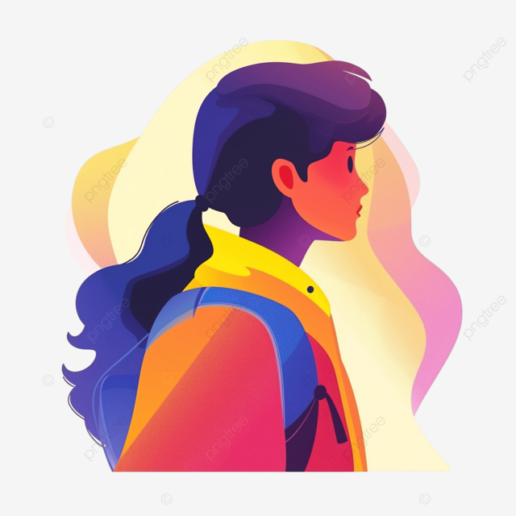

# ACTIVITY 27 CSS_GRID

# Instruction: 

apply it on 5 pages (ex. list of products,list of employees, list of students, etc) - name your repo CSS_GRID - add documentation on README.md of your repo - Submit github repositories

* Products List: A grid showcasing products with images, names, and prices.
* Employees List: Grid cards for employee profiles, with positions and contact details.
* Students List: Cards for student profiles, including names and areas of study.
* Gallery: Display a grid of projects with descriptions.
* Services List: A section highlighting services in a visually appealing grid.

 ## How to Use Grid

* `* { box-sizing: border-box; }` - Ensures padding and border are included in an element’s total width and height, helping with consistent spacing.

*  `display: grid;` - Defines the element as a grid container, enabling the use of grid layout properties within it.

*  `gap: 16px;` - Adds spacing between grid items, both vertically and horizontally.

*  `grid-template-columns: 1fr;` - Sets the grid to one column, making it responsive by default on small screens (mobile-first design).

*  `grid-template-columns: repeat(auto-fill, minmax(300px, 1fr));` - Automatically fills the container with columns that are at least 300px wide. When screen space allows, more columns will fit in, adapting to larger screens.

*  `border: 1px solid #ddd;` - Adds a light border around each card, enhancing separation between items.

*  `border-radius: 8px;` - Rounds the corners of elements (e.g., images, cards) for a softer look.

*  `text-align: center;` - Centers text within elements like headings (h2) and .card, improving visual balance.

*  `padding: 16px;` - Adds internal space around content inside .card, creating a cleaner, less cramped look.

*  `@media (min-width: 600px) { ... }` - Applies responsive adjustments to the layout on screens wider than 600px, helping the layout adapt for desktops and larger tablets.

*  `transition: background-color 0.3s ease;` - Smoothens the color change effect for buttons on hover, making interactions feel more polished.

# employee.html
```
<!DOCTYPE html>
<html lang="en">
<head>
  <meta charset="UTF-8">
  <meta name="viewport" content="width=device-width, initial-scale=1.0">
  <title>ACT 26 Responsive Flexbox Layout</title>
  <link rel="stylesheet" href="employee.css">
</head>
<body>
      <!-- Employee Cards Section -->
  <section class="section">
    <h2>Employee Cards</h2>
    <div class="container">
      <div class="card">
        
        <h3>Mary</h3>
        <p>Position: Developer</p>
      </div>
      <div class="card">
        
        <h3>Joy</h3>
        <p>Position: Designer</p>
      </div>
      <div class="card">
        
        <h3>Jhames</h3>
        <p>Position: Manager</p>
      </div>
    </div>
  </section>
</body>
```
# employee.css
```
* {
    box-sizing: border-box;
    margin: 0;
    padding: 0;
  }
  
  body {
    font-family: Arial, sans-serif;
    line-height: 1.6;
    padding: 20px;
    background-color: #f9f9f9;
  }
  
  h2 {
    margin-bottom: 20px;
    font-size: 1.8em;
    text-align: left;
    color: #333;
  }
  
  .section {
    margin-bottom: 40px;
  }
  
  .container {
    display: grid;              
    gap: 16px;                  
    grid-template-columns: 1fr; 
  }
  
  .card {
    background-color: #fff;
    padding: 16px;
    border: 1px solid #ddd;
    border-radius: 8px;
    text-align: center;
  }
  
  .card img {
    width: 100%;
    height: auto;
    border-radius: 8px;
  }
  
  .card h3 {
    font-size: 1.2em;
    margin-top: 8px;
  }
  
  .card p {
    font-size: 0.9em;
    margin: 8px 0;
  }
  
  .card button {
    padding: 8px 16px;
    margin-top: 8px;
    background-color: #0bc55f;
    color: #fff;
    border: none;
    border-radius: 4px;
    cursor: pointer;
  }
  
  .card button:hover {
    background-color: #ed0909;
  }
  
  /* Responsive adjustments (optional, as grid-template-columns handles responsiveness well) */
  @media (min-width: 600px) {
    .container {
        grid-template-columns: repeat(auto-fill, minmax(300px, 1fr)); /* More space for larger screens */
    }
  }
  
```

# product.html
```
<!DOCTYPE html>
<html lang="en">
<head>
  <meta charset="UTF-8">
  <meta name="viewport" content="width=device-width, initial-scale=1.0">
  <title>ACT 27 Responsive Flexbox Layout</title>
  <link rel="stylesheet" href="product.css">
</head>
<body>
    
  <!-- Product Layout Section -->
  <section class="section">
    <h2>Product Layout</h2>
    <div class="container">
      <div class="card">
        
        <h3>Product 1</h3>
        <p>Labubu 1</p>
        <button>Buy Now</button>
      </div>
      <div class="card">
        
        <h3>Product 2</h3>
        <p>Labubu 2</p>
        <button>Buy Now</button>
      </div>
      <div class="card">
        
        <h3>Product 3</h3>
        <p>Labubu 3</p>
        <button>Buy Now</button>
      </div>
      <div class="card">
        
        <h3>Product 4</h3>
        <p>Labubu 4</p>
        <button>Buy Now</button>
      </div>
    </div>
  </section>
```

# product.css
```
* {
    box-sizing: border-box;
    margin: 0;
    padding: 0;
  }
  
  body {
    font-family: Arial, sans-serif;
    line-height: 1.6;
    padding: 20px;
    background-color: #f9f9f9;
  }
  
  h2 {
    margin-bottom: 20px;
    font-size: 1.8em;
    text-align: left;
    color: #333;
  }
  
  .section {
    margin-bottom: 40px;
  }
  
  .container {
    display: grid;              
    gap: 16px;                  
    grid-template-columns: 1fr; 
  }
  
  .card {
    background-color: #fff;
    padding: 16px;
    border: 1px solid #ddd;
    border-radius: 8px;
    text-align: center;
  }
  
  .card img {
    width: 100%;
    height: auto;
    border-radius: 8px;
  }
  
  .card h3 {
    font-size: 1.2em;
    margin-top: 8px;
  }
  
  .card p {
    font-size: 0.9em;
    margin: 8px 0;
  }
  
  .card button {
    padding: 8px 16px;
    margin-top: 8px;
    background-color: #0bc55f;
    color: #fff;
    border: none;
    border-radius: 4px;
    cursor: pointer;
  }
  
  .card button:hover {
    background-color: #ed0909;
  }
  
  /* Responsive adjustments (optional, as grid-template-columns handles responsiveness well) */
  @media (min-width: 600px) {
    .container {
        grid-template-columns: repeat(auto-fill, minmax(300px, 1fr)); /* More space for larger screens */
    }
  }
```

# gellery.html
```
<!DOCTYPE html>
<html lang="en">
<head>
  <meta charset="UTF-8">
  <meta name="viewport" content="width=device-width, initial-scale=1.0">
  <title>ACT 27 Responsive Flexbox Layout</title>
  <link rel="stylesheet" href="gallery.css">
</head>
<body>
  

  <!-- Gallery Section -->
  <section class="section">
    <h2>Gallery</h2>
    <div class="container">
      <div class="card">
        
      </div>
      <div class="card">
        
      </div>
      <div class="card">
        
      </div>
      <div class="card">
        
      </div>
    </div>
  </section>
  </body>

```

# gallery.css
```
* {
    box-sizing: border-box;
    margin: 0;
    padding: 0;
  }
  
  body {
    font-family: Arial, sans-serif;
    line-height: 1.6;
    padding: 20px;
    background-color: #f9f9f9;
  }
  
  h2 {
    margin-bottom: 20px;
    font-size: 1.8em;
    text-align: left;
    color: #333;
  }
  
  .section {
    margin-bottom: 40px;
  }
  
  .container {
    display: grid;              
    gap: 16px;                  
    grid-template-columns: 1fr; 
  }
  
  .card {
    background-color: #fff;
    padding: 16px;
    border: 1px solid #ddd;
    border-radius: 8px;
    text-align: center;
  }
  
  .card img {
    width: 100%;
    height: auto;
    border-radius: 8px;
  }
  
  .card h3 {
    font-size: 1.2em;
    margin-top: 8px;
  }
  
  .card p {
    font-size: 0.9em;
    margin: 8px 0;
  }
  
  .card button {
    padding: 8px 16px;
    margin-top: 8px;
    background-color: #0bc55f;
    color: #fff;
    border: none;
    border-radius: 4px;
    cursor: pointer;
  }
  
  .card button:hover {
    background-color: #ed0909;
  }
  
  /* Responsive adjustments (optional, as grid-template-columns handles responsiveness well) */
  @media (min-width: 600px) {
    .container {
        grid-template-columns: repeat(auto-fill, minmax(300px, 1fr)); /* More space for larger screens */
    }
  }
  
```

# student-profile-list.html
```
<!DOCTYPE html>
<html lang="en">
<head>
  <meta charset="UTF-8">
  <meta name="viewport" content="width=device-width, initial-scale=1.0">
  <title>ACT 27 Responsive Flexbox Layout</title>
  <link rel="stylesheet" href="student.css">
</head>
<body>
      <!-- Student Profiles Section -->
  <section class="section">
    <h2>Student Profiles</h2>
    <div class="container">
      <div class="card">
        
        <h3>zeke</h3>
        <p>Course: Computer Science</p>
      </div>
      <div class="card">
        
        <h3>ace</h3>
        <p>Course: Information Technology</p>
      </div>
      <div class="card">
        
        <h3>izzy</h3>
        <p>Course: Business</p>
      </div>
    </div>
  </section>
</body>
```
# student.css
```
* {
    box-sizing: border-box;
    margin: 0;
    padding: 0;
  }
  
  body {
    font-family: Arial, sans-serif;
    line-height: 1.6;
    padding: 20px;
    background-color: #f9f9f9;
  }
  
  h2 {
    margin-bottom: 20px;
    font-size: 1.8em;
    text-align: left;
    color: #333;
  }
  
  .section {
    margin-bottom: 40px;
  }
  
  .container {
    display: grid;              
    gap: 16px;                  
    grid-template-columns: 1fr; 
  }
  
  .card {
    background-color: #fff;
    padding: 16px;
    border: 1px solid #ddd;
    border-radius: 8px;
    text-align: center;
  }
  
  .card img {
    width: 100%;
    height: auto;
    border-radius: 8px;
  }
  
  .card h3 {
    font-size: 1.2em;
    margin-top: 8px;
  }
  
  .card p {
    font-size: 0.9em;
    margin: 8px 0;
  }
  
  .card button {
    padding: 8px 16px;
    margin-top: 8px;
    background-color: #0bc55f;
    color: #fff;
    border: none;
    border-radius: 4px;
    cursor: pointer;
  }
  
  .card button:hover {
    background-color: #ed0909;
  }
  
  /* Responsive adjustments (optional, as grid-template-columns handles responsiveness well) */
  @media (min-width: 600px) {
    .container {
        grid-template-columns: repeat(auto-fill, minmax(300px, 1fr)); /* More space for larger screens */
    }
  }
  
```


